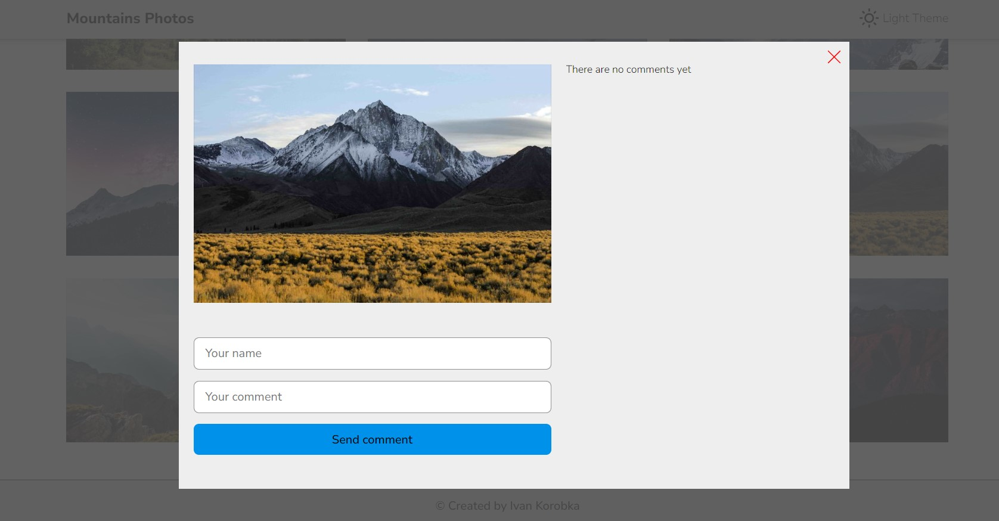

## Description

This SPA was created to showcase various mountain photos and allow users to add comments for each of them. I used Typescript, React, RTK Query, and styled-components. It is adapted for all standard mobile device screen sizes.

## Tools:

- typescript
- react
- rtk-query
- redux-persist
- react-icons
- react-router-dom v6
- react-spinners
- react-remove-scroll-bar
- nanoid
- styled-components

## Features:

- Switch theme
- Show mountain card popup
- Add comments to some mountain card
  

## Running the project locally:

- Clone the branch or download the repository to your computer.
- Run the npm install command in the integrated terminal of your IDE to install all required dependencies.
- Run the npm run dev command in the integrated terminal of your IDE to run the project locally.
